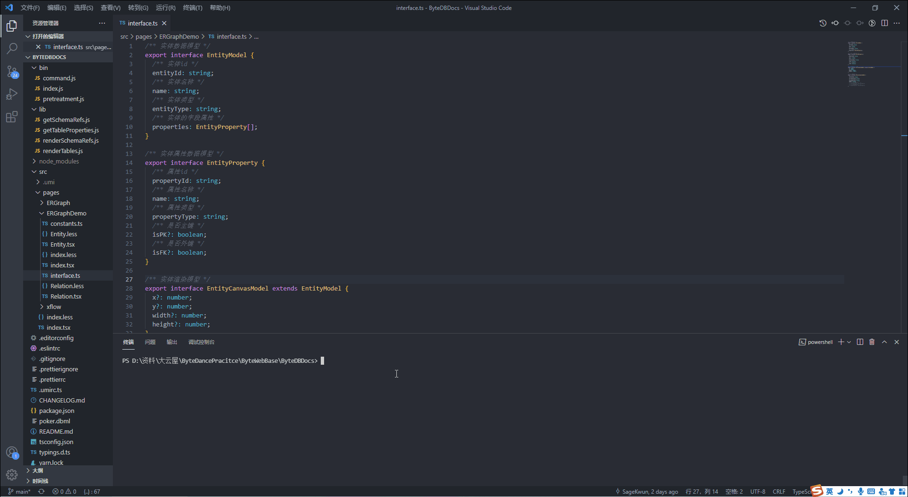
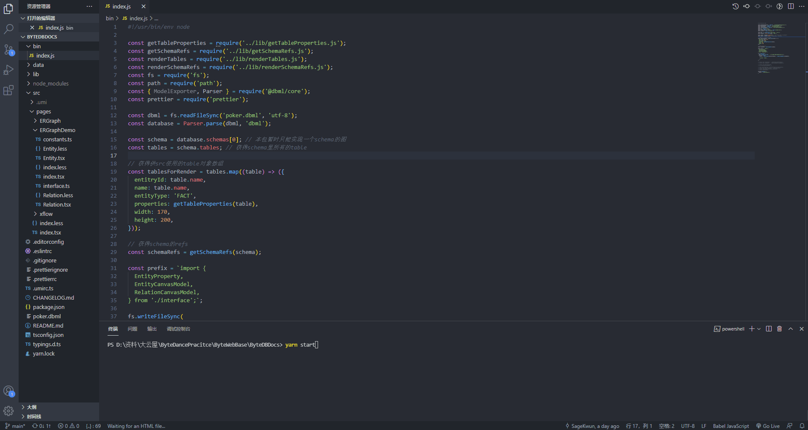

# ByteDBDocs

## 开始

安装依赖

```bash
$ yarn
```

开启开发服务器

```bash
$ yarn start
```

转换dbml文件为js

```bash
$ byte-db-docs build <file>
```

## 实现效果
编译


启动服务


打开界面


## 文件结构

```
├── bin
│   └──index.js               # 处理.dbml文件的脚本
├── src
│   └──pages
│      └──ERGraphDemo
│         └──mock.ts          # 储存数据
├── lib                       # bin调用的函数库
└── src                       # 可视化代码
```

## 开发流程思路

1. 通过包读取.dbml文件并得到db对象
2. 根据db对象生成`mock.ts`
3. 将`mock.ts`加入模板中，并使用`antv x6`进行可视化渲染

## 参考资料

[antv x6](https://x6.antv.vision/zh/docs/tutorial/about)

[DBML api](https://www.dbml.org/js-module/#api)
